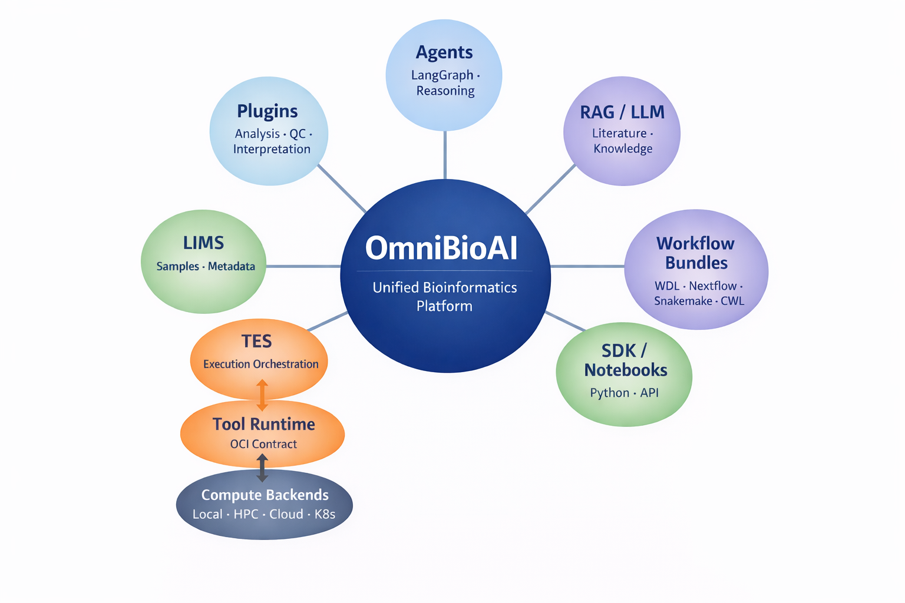

# OmniBioAI Local Development & Deployment Workspace

This repository defines the **local development workspace, orchestration layer, and deployment entry point** for the **OmniBioAI ecosystem**.

**OmniBioAI is a reproducible scientific execution and reasoning platform** — not a workflow runner, and not an AI wrapper — designed to run consistently across **local machines, on-prem servers, HPC environments, and cloud infrastructure**, with **no mandatory cloud dependencies**.

This repository does **not** embed core application logic.
Instead, it acts as a **control plane and workspace coordinator**, assembling multiple independently versioned OmniBioAI components into a **single runnable ecosystem**.

> Think of this repository as the **assembly, runtime, and operational layer** for OmniBioAI.

---

## Architecture Overview




## Who This Repository Is For

This workspace is intended for:

* Core OmniBioAI developers
* Power users running full local or on-prem stacks
* HPC / infrastructure teams deploying OmniBioAI services
* Enterprise or regulated environments requiring offline or air-gapped installs

It is **not required** for:

* Plugin-only development
* SDK-only usage
* End users consuming a hosted OmniBioAI instance

---

## Purpose of This Repository

This workspace provides:

* A **single-root project layout** for OmniBioAI development
* Docker Compose–based orchestration for the full stack
* Shared configuration, data, and working directories
* Optional offline / air-gapped deployment support
* A foundation for HPC (Apptainer/Singularity) and Kubernetes deployments

This repository **orchestrates** OmniBioAI components; it does not vendor or fork them.

---

## Workspace Layout

```text
Desktop/machine/
├── omnibioai/                     # OmniBioAI Workbench (Django core platform)
├── omnibioai-tes/                 # Tool Execution Service (TES)
├── omnibioai-tool-server/         # FastAPI ToolServer (validated tool APIs)
├── omnibioai-tool-runtime/        # Cloud/HPC-agnostic execution runtime
├── omnibioai-lims/                # OmniBioAI LIMS (data & sample management)
├── omnibioai-rag/                 # RAG & LLM-based intelligence services
├── omnibioai_sdk/                 # Python SDK (thin client for APIs)
├── omnibioai-workflow-bundles/    # Workflow bundles (WDL / Nextflow / Snakemake / CWL)
│
├── deploy/                        # Deployment definitions & packaging
│   ├── compose/                  # Docker Compose (canonical runtime)
│   ├── scripts/                  # Bootstrap, bundling, install helpers
│   ├── bundle/                   # Offline / air-gapped release artifacts
│   ├── hpc/                      # Apptainer / Singularity assets
│   └── k8s/                      # Kubernetes / Helm (in progress)
│
├── data/                          # Persistent user & project data
├── work/                          # Workflow execution workspace
├── tmpdata/                       # Temporary / scratch data
├── out/                           # Generated outputs
│
├── db-init/                       # Database initialization dumps
│   ├── omnibioai.sql
│   └── limsdb.sql
│
├── utils/                         # Developer utilities
├── images/                        # Architecture & documentation images
├── backup/                        # Archived / experimental material
│
├── docker-compose.yml             # Full local OmniBioAI stack
├── .env.example                   # Environment variable template
└── README.md
```

> **Note**
> All executable tool containers and cloud/HPC execution contracts now live in
> **`omnibioai-tool-runtime`**.
> Legacy AWS-specific tooling has been consolidated to enforce a **single, backend-agnostic execution layer**.

---

## Architecture Overview

The ecosystem follows a **service-oriented, plugin-first architecture** with strict separation between execution, orchestration, and reasoning.

### Core planes

* **Control plane**
  UI, registries, APIs, metadata, provenance, governance

* **Compute plane**
  Workflow runners, tool execution, HPC and cloud adapters

* **Data plane**
  Objects, artifacts, datasets, workflow outputs

* **AI plane**
  RAG, LLM-backed reasoning, agents, interpretation layers

A key design boundary is enforced:

* Control-plane services are **long-lived and stateful**
* Compute-plane services are **ephemeral and replaceable**
* **TES is the contract boundary** between the two

---

## Canonical Repositories

Each OmniBioAI component is developed and versioned independently.

| Component                        | Repository                                                                                                     |
| -------------------------------- | -------------------------------------------------------------------------------------------------------------- |
| **OmniBioAI Workbench**          | [https://github.com/man4ish/omnibioai](https://github.com/man4ish/omnibioai)                                   |
| **Tool Execution Service (TES)** | [https://github.com/man4ish/omnibioai-tes](https://github.com/man4ish/omnibioai-tes)                           |
| **Tool Runtime**                 | [https://github.com/man4ish/omnibioai-tool-runtime](https://github.com/man4ish/omnibioai-tool-runtime)         |
| **ToolServer**                   | [https://github.com/man4ish/omnibioai-tool-server](https://github.com/man4ish/omnibioai-tool-server)           |
| **OmniBioAI LIMS**               | [https://github.com/man4ish/omnibioai-lims](https://github.com/man4ish/omnibioai-lims)                         |
| **RAG Service**                  | [https://github.com/man4ish/omnibioai-rag](https://github.com/man4ish/omnibioai-rag)                           |
| **Workflow Bundles**             | [https://github.com/man4ish/omnibioai-workflow-bundles](https://github.com/man4ish/omnibioai-workflow-bundles) |
| **OmniBioAI SDK**                | [https://github.com/man4ish/omnibioai_sdk](https://github.com/man4ish/omnibioai_sdk)                           |

This workspace **assembles and runs** these repositories; it does not replace them.

---

## Local Deployment (Docker)

### Prerequisites

* Docker Engine / Docker Desktop
* Docker Compose v2+

### Quick Start

```bash
cp .env.example .env
docker compose up -d
```

Optional (LLM backend):

```bash
docker compose exec ollama ollama pull llama3:8b
```

All services are configurable via `.env`.
No absolute host paths are required.

---

## Offline / Air-Gapped Deployment

OmniBioAI supports **fully offline deployment** using prebuilt bundles.

An offline bundle may include:

* Docker images (`docker save`)
* Pre-seeded volumes (databases, object store, models)
* Compose files and installer scripts

This enables deployment on:

* Secure enterprise networks
* HPC head nodes
* Restricted or regulated environments

See `deploy/` for details.

---

## HPC Deployment (Apptainer / Singularity)

HPC environments typically prohibit Docker daemons.

OmniBioAI supports HPC execution by:

* Running the **control plane** externally (VM, server, or cloud)
* Executing **compute services** on HPC nodes via Apptainer/Singularity
* Preserving identical OCI images and execution contracts

OCI images are converted to `.sif` images and run **without root privileges**.

---

## Kubernetes Deployment (In Progress)

* All services are OCI-compatible
* Helm charts and manifests are under development
* Kubernetes is **not the primary design target**

Focus areas:

* Stateful services (DB, object store)
* Workflow execution scaling
* GPU-aware AI services

The goal is **deployment parity**, not Kubernetes-first architecture.

---

## Operational Modes

| Mode           | Control Plane        | Compute Plane             |
| -------------- | -------------------- | ------------------------- |
| Local dev      | Docker Compose       | Local Docker              |
| On-prem server | Docker Compose       | Docker / TES              |
| HPC            | External VM / server | Apptainer / Slurm via TES |
| Hybrid         | Cloud VM             | HPC + TES                 |
| Cloud          | Kubernetes           | Kubernetes                |

---

## Developer SDK

`omnibioai_sdk/` provides a **thin Python client** for OmniBioAI APIs, intended for:

* Jupyter notebooks
* Analysis scripts
* Workflow tooling
* Programmatic access

The SDK does **not** embed backend logic and is published independently on PyPI.

---

## What This Repository Does Not Do

* It does not contain bioinformatics algorithms
* It does not vendor component repositories
* It does not enforce a specific workflow engine
* It does not require cloud services
* It does not hide execution behind opaque AI calls

---

## Design Principles

* Single workspace root
* Relative paths only
* No hardcoded absolute paths
* Clear service boundaries
* Restart-safe orchestration
* Docker ↔ non-Docker parity
* Portable across environments

These principles allow the same ecosystem to run on laptops, servers, HPC clusters, and cloud platforms.

---

## Services & Default Ports

| Service                | Port | Description               |
| ---------------------- | ---- | ------------------------- |
| OmniBioAI Workbench    | 8000 | UI, plugins, agents       |
| Tool Execution Service | 8080 | Workflow & tool execution |
| ToolServer             | 9090 | External tool APIs        |
| OmniBioAI LIMS         | 7000 | LIMS integration          |
| MySQL                  | 3306 | Metadata databases        |
| Redis                  | 6379 | Celery, caching           |

All ports are configurable via `.env`.

---

## Recent Architecture & Repository Changes (Feb 2026)

This section records **recent structural and naming changes** in the OmniBioAI ecosystem for traceability.

### Execution Layer Consolidation

* **`omnibioai-tool-runtime`** is now the **single execution contract**

  * Used by AWS Batch, Azure Batch, Kubernetes, and HPC backends
  * Defines logging, results, environment variables, and exit semantics
  * Eliminates backend-specific runtime duplication

* Legacy AWS-specific tooling has been **fully consolidated**

  * Execution logic is no longer cloud-specific
  * Cloud adapters live behind TES, not inside tools

### Repository Role Separation

* **Control plane**: `omnibioai`
* **Execution plane**: `omnibioai-tes` + `omnibioai-tool-runtime`
* **Tool APIs**: `omnibioai-tool-server`
* **Data & metadata**: `omnibioai-lims`
* **AI / reasoning**: `omnibioai-rag`
* **Assembly & deployment**: this repository

This repository remains a **pure orchestration and assembly layer**.

### Scale Update

* OmniBioAI ecosystem size: **~190K total lines**
* Multi-repository, independently versioned architecture

---

## Status

* ✅ Clean, modular workspace
* ✅ Multi-service Docker orchestration
* ✅ Offline-capable architecture
* ✅ HPC-friendly execution model
* ✅ Production-oriented structure

This repository represents the **local control plane and deployment foundation** of the OmniBioAI ecosystem.
