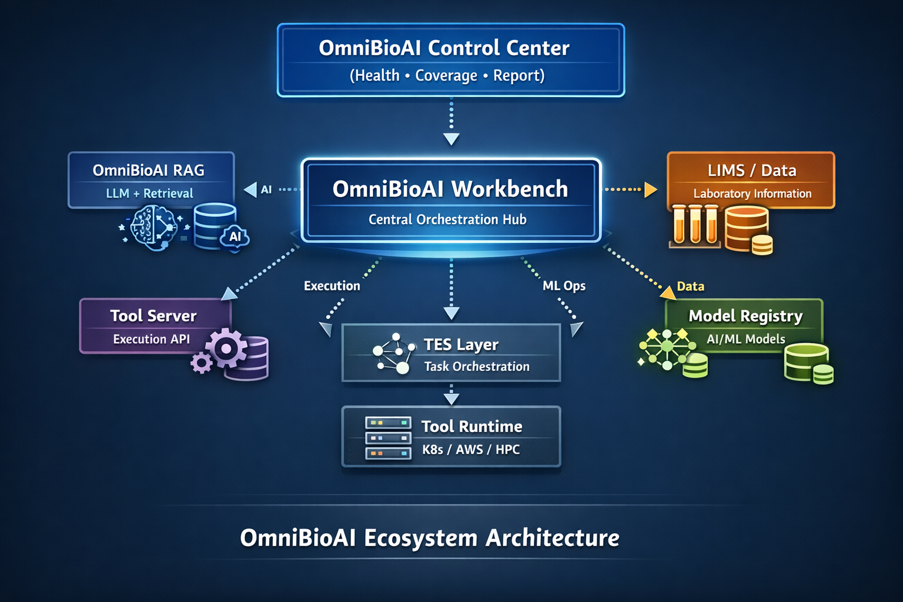

# OmniBioAI Control Center

**Operational health dashboard, ecosystem report server, and observability hub for the OmniBioAI stack.**

The Control Center is a FastAPI service that aggregates health status across all OmniBioAI components, serves an interactive ecosystem report, exposes Prometheus metrics, and auto-generates reports on a configurable schedule.

---

## What It Does

- **Health monitoring** — TCP, HTTP, and disk checks across all ecosystem services
- **Live dashboard** — auto-refreshing browser UI at `/dashboard` with per-service status cards
- **Ecosystem report** — interactive HTML report (architecture · projects · languages · coverage · health) served at `/`
- **JSON API** — machine-readable health summary at `/summary` for CI/CD and external monitoring
- **Scheduled report generation** — auto-regenerates the ecosystem report every N hours (configurable via REPORT_SCHEDULE_HOURS)
- **Prometheus metrics** — `/metrics` endpoint scraped by Prometheus for Grafana dashboards
- **Docker inventory** — platform containers, tool SIF images, and plugin Docker images via `/docker/*` endpoints
- **Structured JSON logging** — all key events logged as JSON to stdout for log aggregation

## Architecture


---

## Repository Structure

```text
omnibioai-control-center/
│
├── scripts/
│   └── generate_report.py          # Ecosystem report generator (CLI)
│
├── backend/
│   ├── pyproject.toml              # Package definition and dependencies
│   ├── src/control_center/
│   │   ├── main.py                 # FastAPI app — registers all routers
│   │   ├── api/
│   │   │   ├── routes_health.py    # GET /health
│   │   │   ├── routes_services.py  # GET /services
│   │   │   ├── routes_summary.py   # GET /summary
│   │   │   └── routes_report.py    # GET /report
│   │   ├── checks/
│   │   │   ├── http.py             # HTTP health checks
│   │   │   ├── tcp.py              # TCP health checks (MySQL, Redis)
│   │   │   └── disk.py             # Disk usage checks
│   │   ├── core/
│   │   │   ├── runner.py           # Dispatches checks per service type
│   │   │   └── settings.py         # Loads control_center.yaml
│   │   └── utils/
│   │       └── summary_client.py   # Fetches /summary for report generation
│   └── tests/
│       ├── test_checks.py          # Unit tests — tcp/http/disk
│       ├── test_runner.py          # Unit tests — runner + settings
│       └── test_summary_client.py  # Unit tests — health data parsing
│
├── compose/
│   └── docker-compose.control-center.yml
├── config/
│   ├── control_center.yaml         # Active configuration
│   └── control_center.example.yaml # Reference configuration
└── docker/
    └── Dockerfile
```

---

## API Endpoints

| Endpoint               | Method | Description |
|------------------------|--------|-------------|
| `/`                    | GET    | Ecosystem report (auto-refreshes) |
| `/dashboard`           | GET    | Live health dashboard UI |
| `/health`              | GET    | Control Center self-check |
| `/services`            | GET    | Per-service health status (JSON) |
| `/summary`             | GET    | Full ecosystem summary — services + disk (JSON) |
| `/report/generate`     | POST   | Trigger background report generation |
| `/report/status`       | GET    | Poll report job state (running/done/error/idle) |
| `/report/data`         | GET    | Structured report data as JSON |
| `/docker/containers`   | GET    | Platform container list with status |
| `/docker/sif-images`   | GET    | Tool SIF image inventory and sizes |
| `/docker/plugin-images`| GET    | Plugin Docker image inventory |
| `/metrics`             | GET    | Prometheus metrics endpoint |

### `/health`

```json
{ "status": "ok" }
```

### `/summary`

```json
{
  "overall_status": "UP",
  "generated_at": "2026-03-20T02:44:00+00:00",
  "services": [
    {
      "name": "omnibioai",
      "type": "http",
      "target": "http://omnibioai:8000/",
      "status": "UP",
      "latency_ms": 12,
      "message": "HTTP 200"
    },
    {
      "name": "mysql",
      "type": "mysql",
      "target": "mysql:3306",
      "status": "UP",
      "latency_ms": 3,
      "message": "TCP connect ok"
    }
  ],
  "system": {
    "disk": [
      {
        "name": "disk:/workspace/out",
        "type": "disk",
        "target": "/workspace/out",
        "status": "UP",
        "latency_ms": null,
        "message": "45.2% free"
      }
    ]
  }
}
```

Status values: `UP` | `DOWN` | `WARN`

---

## Configuration

All monitored services and disk paths are defined in `config/control_center.yaml`.

```yaml
services:
  mysql:
    type: mysql
    host: mysql
    port: 3306

  redis:
    type: redis
    host: redis
    port: 6379

  toolserver:
    type: http
    url: http://toolserver:9090/health
    timeout_s: 2

  tes:
    type: http
    url: http://tes:8081/health
    timeout_s: 2

  omnibioai:
    type: http
    url: http://omnibioai:8000/
    timeout_s: 2

  lims-x:
    type: http
    url: http://lims-x:7000/
    timeout_s: 2

  model-registry:
    type: http
    url: http://model-registry:8095/health
    timeout_s: 2

system:
  disk_checks:
    - path: /workspace/out
      warn_pct_free_below: 15
    - path: /workspace/tmpdata
      warn_pct_free_below: 10
    - path: /workspace/local_registry
      warn_pct_free_below: 10
```

### Supported check types

| Type | Required fields | Description |
|------|----------------|-------------|
| `http` | `url`, `timeout_s` | HTTP GET — UP if 2xx, WARN if 3xx/4xx/5xx |
| `mysql` | `host`, `port` | TCP connect to MySQL port |
| `redis` | `host`, `port` | TCP connect to Redis port |

### Adding a new service

Add a block to `config/control_center.yaml` and restart the container:

```yaml
services:
  my-new-service:
    type: http
    url: http://my-service:8080/health
    timeout_s: 2
```

No code changes required.

---

## Running

### Via Docker Compose (recommended)

```bash
# From the ecosystem root (~/Desktop/machine)
docker compose \
  --project-directory . \
  -f omnibioai-control-center/compose/docker-compose.control-center.yml \
  up -d
```

Access at: `http://localhost/_svc/control` (JWT required)

For local scripts and Prometheus scraping (localhost only):
`http://127.0.0.1:7070`

> **Note:** Port 7070 is bound to `127.0.0.1` only in production.
> External access requires a valid JWT via the nginx reverse proxy.

### Standalone (development)

```bash
cd backend
pip install -e ".[dev]"

CONTROL_CENTER_CONFIG=../config/control_center.yaml \
WORKSPACE_ROOT=~/Desktop/machine \
uvicorn control_center.main:app --host 0.0.0.0 --port 7070 --reload
```

### Environment variables

| Variable                | Default                       | Description |
|-------------------------|-------------------------------|-------------|
| `CONTROL_CENTER_CONFIG` | `/config/control_center.yaml` | Path to YAML config |
| `WORKSPACE_ROOT`        | `/workspace`                  | Ecosystem root |
| `CONTROL_CENTER_PORT`   | `7070`                        | Service port |
| `REPORT_SCHEDULE_HOURS` | `6`                           | Auto-regenerate report every N hours |

---

## Ecosystem Report

The report is a single interactive HTML file with five tabs:

| Tab | Contents |
|-----|----------|
| Architecture | SVG lane diagram of all services and connections |
| Projects | Code line distribution across all repositories |
| Languages | Language breakdown across the ecosystem |
| Code Coverage | Per-repo pytest coverage with progress bars |
| Health Status | Live service and disk health snapshot |

### Generate

```bash
# From the ecosystem root — with live health data
python omnibioai-control-center/scripts/generate_report.py \
    --root ~/Desktop/machine

# Skip health check (faster, offline)
python omnibioai-control-center/scripts/generate_report.py \
    --root ~/Desktop/machine \
    --skip-health

# Skip coverage collection (code stats only, very fast)
python omnibioai-control-center/scripts/generate_report.py \
    --root ~/Desktop/machine \
    --skip-coverage

# All options
python omnibioai-control-center/scripts/generate_report.py \
    --root ~/Desktop/machine \
    --control-center-url http://127.0.0.1:7070 \
    --out out/reports/omnibioai_ecosystem_report.html \
    --title "OmniBioAI Ecosystem Report"
```

### Requirements

```bash
# cloc for code counting
sudo apt-get install cloc        # Ubuntu/Debian
conda install -c conda-forge cloc  # Conda

# Python dependencies
pip install pandas

# For coverage collection (best-effort)
pip install pytest pytest-cov
```

### View

- **File:** `~/Desktop/machine/out/reports/omnibioai_ecosystem_report.html`
- **Browser:** Open directly — no server needed
- **Live:** `http://localhost/_svc/control` when Control Center is running

The report generates gracefully even if the Control Center is offline or coverage collection fails — those tabs show a clear unavailable state rather than breaking the whole report.

---

## Running Tests

```bash
cd backend
pip install -e ".[dev]"
pytest tests/ -v
```

### Test coverage

| File | What it tests |
|------|--------------|
| `test_checks.py` | TCP, HTTP, and disk check modules |
| `test_runner.py` | Service type routing, settings loading |
| `test_summary_client.py` | Health data parsing, `/summary` fetch |

Tests use in-process HTTP servers — no external dependencies or running services required.

---

## Design Principles

- **Stateless** — no database, no persistent state
- **Config-driven** — add services via YAML, no code changes
- **Graceful degradation** — unreachable services show `DOWN`, never crash the dashboard
- **Zero mandatory cloud** — runs fully offline and air-gapped
- **Minimal dependencies** — FastAPI, uvicorn, PyYAML, pydantic only
- **stdlib HTTP in report** — `urllib` used for health fetching in report generator, no extra deps
- **Design-token driven** — CSS uses `@man4ish/design-tokens` vocabulary; zero hardcoded hex values in the report or dashboard
- **Structured logging** — all key events (startup, report triggered/finished/failed, scheduler) emitted as JSON to stdout

---

## Planned Enhancements (Post-Beta)

- Historical uptime tracking
- Alert hooks (Slack, email)
- Trend view — coverage and health over time

---

## Current Status — v0.2.0

| Feature | Status |
|---------|--------|
| HTTP health checks | ✓ Stable |
| TCP checks (MySQL, Redis) | ✓ Stable |
| Disk usage checks | ✓ Stable |
| Live dashboard UI | ✓ Stable |
| JSON summary API | ✓ Stable |
| Ecosystem report — Architecture | ✓ Stable |
| Ecosystem report — Projects | ✓ Stable |
| Ecosystem report — Languages | ✓ Stable |
| Ecosystem report — Coverage | ✓ Stable |
| Ecosystem report — Health tab | ✓ Stable |
| Unit tests | ✓ Stable |
| Docker Compose deployment | ✓ Stable |
| Prometheus metrics (/metrics) | ✓ Stable |
| Scheduled report generation | ✓ Stable |
| JWT authentication (via nginx) | ✓ Stable |
| Background report job API | ✓ Stable |
| Docker inventory endpoints | ✓ Stable |
| Structured JSON logging | ✓ Stable |
| Design token CSS alignment | ✓ Stable |
| Historical tracking | Planned |
| Alert hooks (Slack, email) | Planned |
| Trend view | Planned |

---

## License

Apache License 2.0
